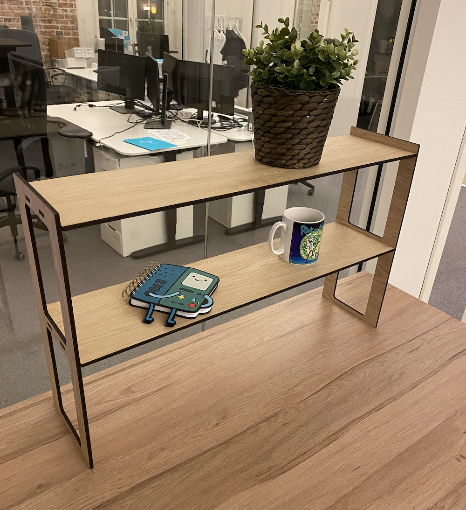

# Dynamic shelf
Dynamic shelf for laser cutting. Created with OpenSCAD.
You can specify width, depth, height and number of shelves.

Also make sure you modify `materialThickness`, `kerf` and perhaps `fittingOffset`. variables before cutting. The variables set worked well for me with 6mm plywood.

